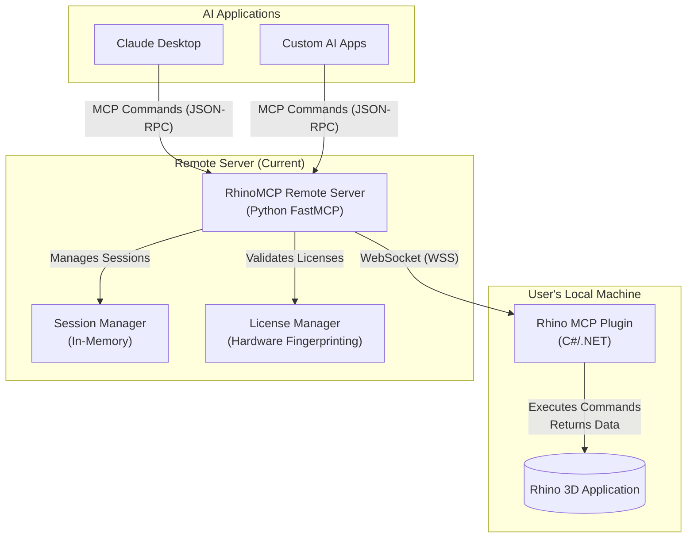

# RhinoMCP Remote Server

**RhinoMCP Remote Server** is a proprietary, cloud-hosted server for the Model Context Protocol (MCP). It provides a robust, scalable bridge between AI host applications (like Claude) and users' local Rhino/Grasshopper instances through WebSocket connections.

**IMPORTANT: This is proprietary software owned by Reer, Inc. All rights reserved.**

## Current Implementation

This repository contains a **Python-based FastMCP server** that provides remote connectivity to Rhino instances. The server enables AI applications to interact with Rhino through a comprehensive set of MCP tools, supporting both direct TCP connections and remote WebSocket connections.

### Key Features
- **License-based Authentication**: Secure connections with hardware fingerprinting
- **Real-time WebSocket Communication**: Persistent connections to Rhino instances
- **Comprehensive MCP Tool Suite**: 13+ tools for complete Rhino interaction
- **Visual Feedback**: Viewport capture and image processing
- **Unit-aware Operations**: Automatic scaling based on document units
- **Session Management**: Multi-user, multi-instance support

## System Architecture

The current implementation consists of three core components:

1. **AI Host Applications**: External applications (Claude Desktop, custom AI assistants) that send MCP commands
2. **RhinoMCP Remote Server**: Python FastMCP server that manages WebSocket connections, authentication, and message routing
3. **Rhino Plugin**: C#/.NET plugin running in Rhino that executes CAD commands and responds via WebSocket

### Technology Stack

- **Backend**: Python 3.9+ with FastMCP SDK
- **WebSocket Communication**: Native WebSocket support with persistent connections
- **Session Management**: In-memory storage with Redis-compatible interface
- **Authentication**: License-based with hardware fingerprinting
- **Image Processing**: Base64 encoding/decoding for viewport captures
- **Logging**: Structured logging for debugging and monitoring



## MCP Tools Available

The server provides 13+ comprehensive MCP tools for complete Rhino interaction:

### Scene Information
- **`get_rhino_scene_info`**: Get document info, units, layers, and object counts
- **`get_rhino_objects_info`**: Retrieve detailed object information with attributes
- **`get_rhino_selected_objects`**: Get information about currently selected objects

### Object Management
- **`create_rhino_basic_geometries`**: Create geometric primitives (box, sphere, cylinder, etc.)
- **`select_filtered_rhino_objects`**: Select objects by various criteria (layer, type, name)
- **`modify_rhino_objects`**: Apply transformations with chained operations:
  - Rotate, translate, scale
  - Change colors and properties
  - Sequential or combined execution modes
- **`delete_rhino_objects`**: Remove objects from document

### Metadata Management
- **`add_rhino_objects_metadata`**: Add names and descriptions to objects
- **`update_rhino_objects_metadata`**: Update existing object metadata

### Layer Management
- **`create_rhino_layers`**: Create and configure layers with colors and properties
- **`delete_rhino_layers`**: Remove layers from document

### Visual Feedback
- **`capture_rhino_viewport`**: Take screenshots of the Rhino viewport
  - Layer-specific capture
  - Automatic image encoding/decoding
  - Configurable resolution and annotations

### Code Execution
- **`execute_rhinoscript`**: Run Python code using rhinoscriptsyntax
  - Full access to Rhino API
  - Error handling and output capture
  - Support for complex geometric operations

### Advanced Features
- **Unit-aware Operations**: Automatic scaling based on document units (mm, m, inches, feet)
- **Chained Transformations**: Sequential operations (rotate → translate → recolor)
- **Robust Error Handling**: Graceful fallbacks and informative error messages
- **Object ID Management**: Handles both ID and name-based object references

## Quick Start

### Prerequisites
- **Python 3.9+** with pip
- **Rhino 7/8** with RhinoMCP plugin installed
- **Valid License** for remote connections

### Server Setup
```bash
# Clone repository
git clone https://github.com/reer-ide/rhino_mcp_remote.git
cd rhino_mcp_remote

# Create a virtual environment
uv venv

# Install dependencies 
uv sync

# Activate virtual environment
source .venv/bin/activate

# Start the remote server
python -m remote_server.server
```

### Plugin Connection
1. Open Rhino with the RhinoMCP plugin loaded (see tests/TESTS.md for more details)
2. Run `ReerStart` command in Rhino
3. Choose "remote" connection type
4. Enter server URL: `http://127.0.0.1:8080`
5. The plugin will establish a WebSocket connection

## Testing

The project includes comprehensive integration tests that verify the complete workflow between AI applications, the remote server, and Rhino instances.

### Quick Test Run
```bash
# Full integration test (requires manual setup)
python tests/test_integration_connected_flow.py

# Quick tool test (uses existing session)
python tests/test_integration_connected_flow.py quick
```

### Test Features

#### Comprehensive Workflow Testing
The integration test covers a complete 12-phase workflow:

1. **Scene Assessment** - Extract document units and baseline state
2. **Infrastructure Setup** - Create dedicated test layer
3. **Object Creation** - Generate scaled geometric objects (box, sphere, cylinder)
4. **Metadata Management** - Add and update object metadata
5. **Information Retrieval** - Query all objects with attributes
6. **Selection & Modification** - Select objects and apply chained transformations
7. **Viewport Capture** - Take and save screenshot with auto-decode
8. **Script Execution** - Run complex Python script (spiral curve creation)
9. **Visual Verification** - Interactive inspection before cleanup
10. **Final Assessment** - Compare end state with initial state
11. **Cleanup** - Remove all test objects and layers
12. **Verification** - Ensure complete cleanup

#### Unit-Aware Object Scaling
Objects are automatically scaled based on document units for optimal visibility:

| Units | Scale Factor | Example Box Size |
|-------|-------------|------------------|
| Millimeters | 100x | 500mm × 300mm × 200mm |
| Meters | 0.1x | 0.5m × 0.3m × 0.2m |
| Inches/Feet | 10x | 50in × 30in × 20in |

#### Interactive Visual Verification
Before cleanup, the test pauses for manual inspection:

```
👁️ VISUAL INSPECTION REQUIRED
📋 Expected objects on layer 'IntegrationTest_Layer' (scaled 100.0x for Millimeters):
  • TestBox_1 - dimensions: 500.0 x 300.0 x 200.0 - should be rotated and moved
  • TestSphere_1 - radius: 200.0 at (1000.0, 0, 0) - should be rotated and moved
  • TestCylinder_1 - radius: 150.0, height: 400.0 at (2000.0, 0, 0)
  • IntegrationTest_Spiral - A spiral curve starting around (3000.0, 0, 0) area

🎨 Visual checks:
  • Objects should be visible on the integration test layer
  • Box and sphere should have blue color (100, 200, 255) from modification
  • Objects should be displaced from their original positions due to rotation + translation

✅ Can you see the expected objects in Rhino? (y/n/s):
```

#### Automatic Screenshot Capture
Viewport images are automatically captured, decoded, and saved:
```
📸 Viewport captured (250ms)
💾 Viewport image saved: viewport_capture_20250723_143022.png
📂 Full path: C:\path\to\tests\viewport_capture_20250723_143022.png
```

#### Test Results and Artifacts
- **JSON Report**: `integration_test_results.json` with detailed results
- **Screenshots**: Timestamped PNG files of viewport captures  
- **Console Logs**: Comprehensive execution logging
- **Performance Metrics**: Response times for each operation

### Example Test Output
```
🧪 Running Comprehensive MCP Tool Tests
Following logical workflow: Scene Info → Layer → Objects → Metadata → Modify → Script → Cleanup

📋 PHASE 1: Initial Scene Assessment
   ✅ Initial scene info retrieved (151ms)
   📏 Document units: Millimeters
   📐 Scaling objects by 100.0x for millimeter units

📦 PHASE 3: Object Creation
   ✅ Test objects created (211ms)
   📝 Captured object ID: 64ad718e-0fda-43de-9777-a62169803e97
   📊 Total object IDs captured: 3

🎯 PHASE 6: Object Selection and Modification
   ✅ Objects selected by layer (49ms)
   ✅ Objects modified with chained operations (Sequential execution) (187ms)

📸 PHASE 7: Viewport Capture
   ✅ Viewport captured (285ms)
   💾 Viewport image saved: viewport_capture_20250723_143022.png

📊 INTEGRATION TEST RESULTS
✅ Passed: 13
❌ Failed: 0  
📈 Success Rate: 100.0%
```

For detailed testing documentation, see [TEST.md](TEST.md).

## Contributing

Contributions are welcome. Please follow these steps:
1.  Fork the repository.
2.  Create a new branch for your feature or fix.
3.  Submit a pull request with a clear description of your changes.

## License

This is proprietary software owned by Reer, Inc. All rights reserved. The original open-source RhinoMCP project is licensed under MIT.

## Disclaimer

This software is provided "as is", without warranty of any kind. Reer, Inc. is not liable for any damages arising from its use. Unauthorized use is strictly prohibited.

