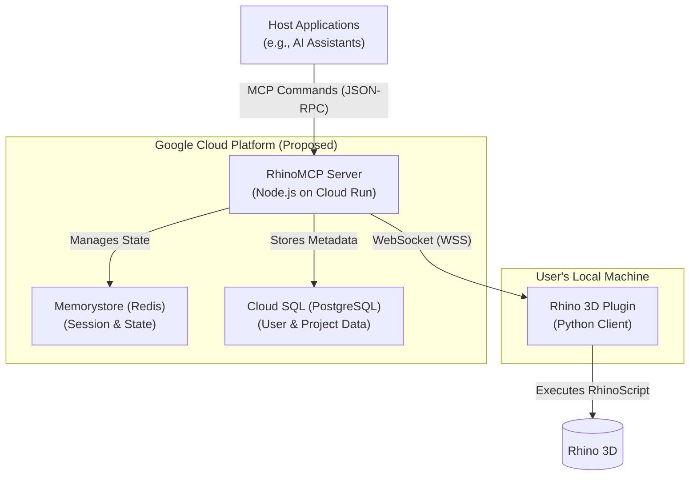

# RhinoMCP Remote Server

**RhinoMCP** is a proprietary, cloud-hosted server for the Model Context Protocol (MCP). It extends the open-source [RhinoMCP project](https://github.com/reer-ide/rhino_mcp) to enable a robust, scalable bridge between AI host applications (like Claude) and a user's local Rhino/Grasshopper instances.

**IMPORTANT: This is proprietary software owned by Reer, Inc. All rights reserved.**

## Project Status & Direction

This repository contains two visions for the RhinoMCP server:

1.  **Current Implementation (legacy Python implementation for local development)**: The existing codebase in `/local_rhino_mcp` is a Python-based implementation designed to run locally and connects Claude desktop to Rhino through stdio. It is the functional basis of the current system.
2.  **Proposed Architecture (Node.js on GCP)**: The documents in the `/docs` folder outline a detailed plan to migrate the server to a more scalable, cloud-native architecture using Node.js/TypeScript on Google Cloud Platform (GCP).

This `README` primarily reflects the **Proposed Architecture**, as it represents the future direction of the project.

## Proposed System Architecture (Node.js on GCP)

The future architecture is designed for high scalability and security, consisting of three core components:

1.  **Host Application**: An external application (e.g., Reer's AI Assistant) that sends MCP commands.
2.  **RhinoMCP Server**: A Node.js/TypeScript server on GCP that manages WebSockets, auth, and message routing.
3.  **Rhino Plugin**: The client-side Python plugin running in Rhino that executes CAD commands.

The server will be built on Google Cloud Platform, leveraging the following services:
- **Google Cloud Run**: For scalable, containerized application hosting.
- **Google Memorystore (Redis)**: For session management and state.
- **Google Cloud SQL (PostgreSQL)**: For persistent user and project data.

### Technology Stack (Corrected)

- **Backend**: Python 3.9+ with FastMCP SDK
- **WebSocket Library**: FastMCP's built-in WebSocket support (with additional Python WebSocket libraries as needed)
- **Database ORM**: SQLAlchemy or async alternatives (e.g., `databases` + `asyncpg`)
- **Authentication**: JWT with OAuth 2.0
- **Containerization**: Docker



## Features

- **Two-way communication**: Connect AI assistants to Rhino via a WebSocket server.
- **Object & Layer Management**: Create, modify, and manage 3D objects and layers in Rhino.
- **Scene Inspection**: Get detailed information and screenshots from the current Rhino scene.
- **Code Execution**: Run arbitrary Python code in Rhino remotely.
- **Multi-Instance Support**: Manage connections to multiple Rhino instances per user.

## Local Development (for proposed Node.js server)

The following steps are for setting up the **future** Node.js development environment.

1.  **Prerequisites**: [Docker](https://www.docker.com/) and [Node.js](https://nodejs.org/) are required.
2.  **Clone & Install**:
    ```bash
    git clone https://github.com/your-repo/rhino_mcp_remote.git
    cd rhino_mcp_remote
    # npm install # (Will be enabled once package.json is added)
    ```
3.  **Run Docker Environment**:
    ```bash
    # docker-compose up --build # (Will be enabled once docker-compose.yml is added)
    ```

## Contributing

Contributions are welcome. Please follow these steps:
1.  Fork the repository.
2.  Create a new branch for your feature or fix.
3.  Submit a pull request with a clear description of your changes.

## License

This is proprietary software owned by Reer, Inc. All rights reserved. The original open-source RhinoMCP project is licensed under MIT.

## Disclaimer

This software is provided "as is", without warranty of any kind. Reer, Inc. is not liable for any damages arising from its use. Unauthorized use is strictly prohibited.

