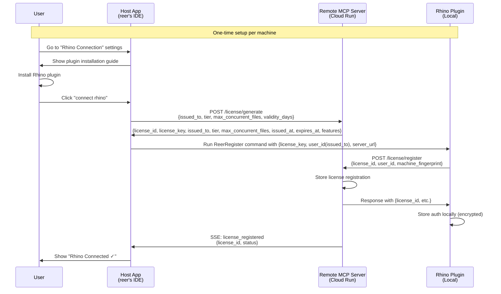
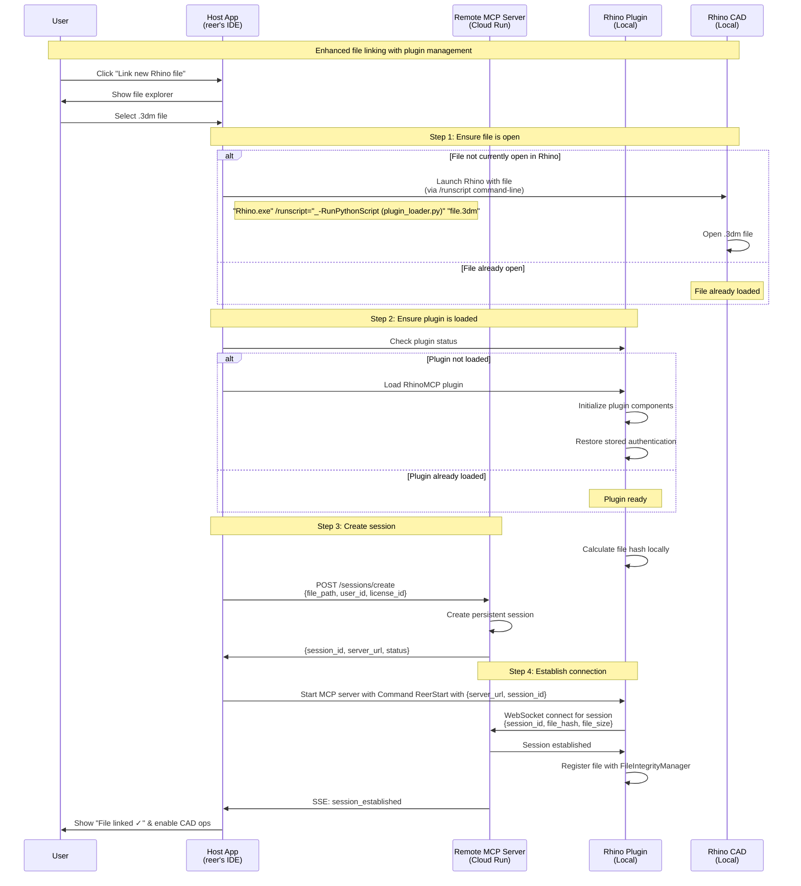
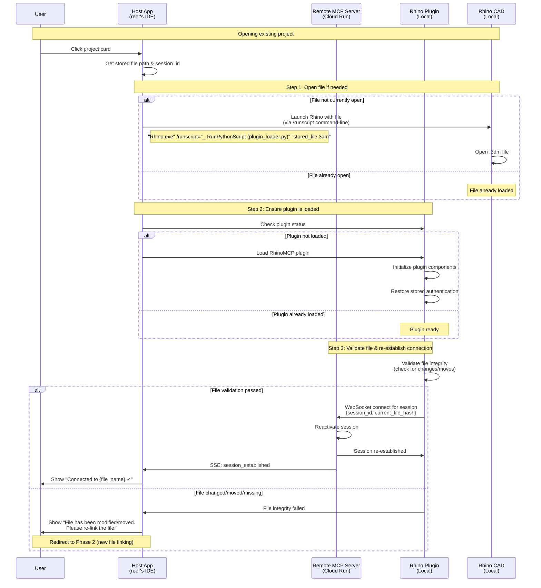
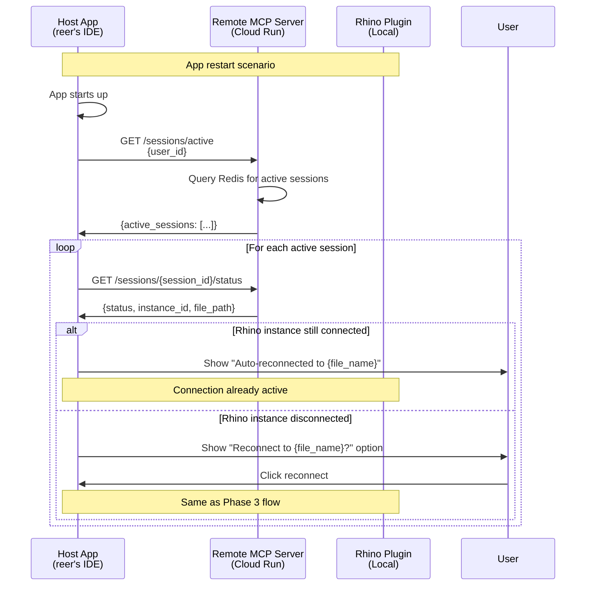

# RhinoMCP System Architecture Design Document

**Version**: 2.0  
**Date**: July 2025  
**Status**: Beta Development

## Executive Summary

RhinoMCP is a remote Model Context Protocol (MCP) server that enables AI-assisted CAD modeling by connecting host applications (like Claude Desktop) with users' local Rhino CAD instances. This document outlines the system architecture for the beta launch on Google Cloud Run, featuring persistent sessions and improved UX flow with separated initialization and file linking.

## System Overview

### Architecture Diagram

```
┌─────────────────┐         ┌──────────────────┐         ┌─────────────────┐
│  Host Apps      │         │  RhinoMCP Server │         │  Rhino Plugin   │
│  (reer's IDE)   │◄───────►│  (Cloud Run)     │◄───────►│  (Local CAD)    │
└─────────────────┘         └──────────────────┘         └─────────────────┘
        │                            │                            │
        │                            ▼                            │
        │                   ┌──────────────────┐                │
        │                   │   Redis Cluster   │                │
        │                   │  (Persistent     │                │
        │                   │   Sessions)      │                │
        │                   └──────────────────┘                │
        │                            │                            │
        │                            ▼                            │
        │                   ┌──────────────────┐                │
        └──────────────────►│   PostgreSQL     │◄───────────────┘
                           │  (User Auth &     │
                           │   File Mapping)   │
                           └──────────────────┘
```

### Core Components

1. **RhinoMCP Server** (FastMCP/Python on Cloud Run)
   - WebSocket server for bidirectional communication
   - MCP protocol implementation
   - Persistent session management
   - License-based authentication
   - Message routing for multiple CAD instances

2. **Redis Cluster** (Google Memorystore)
   - Persistent session state storage
   - License-to-user mapping
   - File-to-session associations
   - Real-time message pub/sub
   - Auto-reconnection metadata

3. **PostgreSQL Database** (Cloud SQL)
   - User profiles and license registrations
   - CAD project metadata and file associations
   - Operation history and audit logs
   - Persistent connection configurations

4. **Rhino Plugin** (Client-side C#/.NET)
   - WebSocket client implementation
   - MCP message handling
   - RhinoScriptSyntax command execution
   - Local authorization storage
   - Auto-reconnection logic

## User Experience Flow Architecture

### Phase 1: One-Time Initialization (Plugin Setup)

This phase separates plugin installation and authorization from file linking, providing a smoother onboarding experience.



### Phase 2: File Linking (Repeatable)

After initialization, linking new files includes file opening, plugin loading, and session creation.



### Phase 3: Opening Already Linked File (Project Cards)

When users click on project cards in the host app, the system opens the file and re-establishes connection.



### Phase 4: Auto-Reconnection (App Restart)

When the host app restarts, it automatically reconnects to existing Rhino instances.



## Data Models and Persistence

### License Registration Model
```typescript
interface LicenseRegistration {
  license_id: string;           // Unique identifier for this machine
  user_id: string;              // Associated user account
  machine_fingerprint: string;  // Hardware/OS fingerprint
  registered_at: datetime;      // Registration timestamp
  last_seen: datetime;          // Last successful connection
  status: 'active' | 'revoked'; // License status
  max_concurrent_files: number; // Limit for this license
}
```

### Persistent Session Model
```typescript
interface PersistentSession {
  session_id: string;           // Unique session identifier
  user_id: string;              // Owner of the session
  license_id: string;           // Associated license
  file_path: string;            // Absolute path to .3dm file
  file_hash: string;            // File content hash for validation
  created_at: datetime;         // Session creation time
  last_active: datetime;        // Last activity timestamp
  status: 'pending' | 'active' | 'dormant' | 'expired';
  instance_id?: string;         // Connected Rhino instance ID
  connection_metadata: {        // Connection state info
    websocket_port?: number;
    last_ip?: string;
    rhino_version?: string;
  };
}
```

## Technical Stack

### Backend Technologies
- **Runtime**: Python 3.11+ with FastMCP framework
- **WebSocket**: websockets library with connection pooling
- **Authentication**: JWT with RSA256 + license-based validation
- **ORM**: SQLAlchemy with async support for PostgreSQL
- **Redis Client**: redis-py with cluster support
- **Logging**: Python logging with Google Cloud Logging integration
- **Monitoring**: Prometheus metrics with custom CAD operation tracking

### Infrastructure
- **Container**: Docker with multi-stage builds
- **Orchestration**: Google Cloud Run (auto-scaling)
- **Load Balancer**: Google Cloud Load Balancing with WebSocket support
- **Storage**: Cloud Storage for file metadata cache
- **Secrets**: Google Secret Manager for sensitive configurations

## Enhanced Connection Management

### License-Based Authentication
```python
# License validation flow
class LicenseValidator:
    async def validate_license(self, license_id: str, machine_fingerprint: str) -> bool:
        # Check if license exists and is active
        license_data = await redis.hget(f"license:{license_id}", "status")
        if not license_data or license_data != "active":
            return False
        
        # Verify machine fingerprint
        stored_fingerprint = await redis.hget(f"license:{license_id}", "fingerprint")
        return stored_fingerprint == machine_fingerprint
```

### Session Persistence Strategy
```python
# Session lifecycle management
class SessionManager:
    async def create_persistent_session(self, user_id: str, file_path: str, license_id: str):
        session = PersistentSession(
            session_id=str(uuid.uuid4()),
            user_id=user_id,
            license_id=license_id,
            file_path=file_path,
            file_hash=await self.calculate_file_hash(file_path),
            status="pending"
        )
        
        # Store in both Redis and PostgreSQL
        await redis.hset(f"session:{session.session_id}", mapping=asdict(session))
        await redis.expire(f"session:{session.session_id}", 86400 * 7)  # 7 days
        await db.sessions.create(session)
        
        return session
    
    async def reactivate_session(self, session_id: str):
        # Restore session from persistence layer
        session_data = await redis.hgetall(f"session:{session_id}")
        if not session_data:
            session_data = await db.sessions.get(session_id)
            if session_data:
                await redis.hset(f"session:{session_id}", mapping=session_data)
        
        return session_data
```

### Auto-Reconnection Logic
```csharp
// Rhino plugin auto-reconnection
public class AutoReconnectionManager
{
    public async Task<bool> CheckPendingSessions()
    {
        var licenseId = GetStoredLicenseId();
        if (string.IsNullOrEmpty(licenseId)) return false;
        
        var response = await httpClient.GetAsync($"/sessions/pending?license_id={licenseId}");
        var pendingSessions = await response.Content.ReadAsAsync<List<PendingSession>>();
        
        foreach (var session in pendingSessions)
        {
            if (IsFileCurrentlyOpen(session.FilePath))
            {
                await ConnectToSession(session.SessionId);
            }
        }
        
        return pendingSessions.Any();
    }
}
```

## Scalability and Performance

### Connection Limits (Updated)
- **Per License**: 3 concurrent file sessions
- **Per Instance**: 100 concurrent WebSocket connections
- **Session TTL**: 7 days dormant, 30 days maximum
- **Message Size**: 1MB maximum per MCP message
- **Reconnection Timeout**: 60 seconds with exponential backoff

### Performance Targets
- **License Validation**: < 50ms lookup time
- **Session Creation**: < 200ms end-to-end
- **Auto-Reconnection**: < 5 seconds for active sessions
- **File Hash Calculation**: < 100ms for files up to 100MB
- **Availability**: 99.7% uptime with graceful degradation

## Security Enhancements

### License-Based Security Model
```typescript
interface SecurityContext {
  license_id: string;           // Hardware-bound license
  user_id: string;              // User account
  machine_fingerprint: string;  // Device identification
  session_capabilities: {       // Per-session permissions
    max_file_size: number;
    allowed_operations: string[];
    rate_limits: {
      commands_per_minute: number;
      data_transfer_mb: number;
    };
  };
}
```

### Enhanced Security Measures
1. **Hardware-bound licensing** with machine fingerprinting
2. **Session-scoped tokens** with automatic rotation
3. **File integrity validation** via SHA-256 hashes
4. **Rate limiting per license** to prevent abuse
5. **Audit trail** for all CAD operations and file access
6. **Encrypted local storage** for authentication data

## Error Handling and Resilience

### Enhanced Retry Strategy
- **License validation failures**: 3 retries with 1s, 2s, 4s delays
- **Session creation failures**: Exponential backoff up to 30s
- **WebSocket disconnections**: Auto-reconnect with session restoration
- **File access errors**: Graceful degradation with user notification
- **Redis failures**: Fallback to PostgreSQL with eventual consistency

### Error Categories and Responses
```
1000-1099: License and authentication errors
1100-1199: Session management errors
2000-2099: Connection and network errors
3000-3099: MCP protocol errors
4000-4099: CAD operation errors
5000-5099: File system and I/O errors
6000-6099: Auto-reconnection errors
```

## Monitoring and Observability

### Enhanced Metrics
- **License Metrics**:
  - Active licenses count
  - License utilization rate
  - Registration success rate
  - Machine fingerprint conflicts

- **Session Metrics**:
  - Persistent session count
  - Session lifetime distribution
  - Auto-reconnection success rate
  - File-to-session ratio per user

- **Performance Metrics**:
  - Session creation latency
  - Auto-reconnection latency
  - File hash calculation time
  - License validation time

### Logging Strategy (Enhanced)
```typescript
// Enhanced structured logging
{
  "timestamp": "2024-12-01T10:00:00Z",
  "level": "info",
  "service": "rhinomcp-server",
  "license_id": "lic_abc123",
  "user_id": "user_def456",
  "session_id": "ses_ghi789",
  "operation": "auto_reconnect",
  "file_path": "/path/to/model.3dm",
  "duration_ms": 1200,
  "status": "success",
  "metadata": {
    "rhino_version": "8.0.23304",
    "file_size_mb": 45.2,
    "reconnection_attempt": 1
  }
}
```

## Implementation Phases

### Phase 1: Core Persistent Sessions (Week 1-2)
1. Implement license registration system
2. Create persistent session storage in Redis/PostgreSQL
3. Update session creation/management APIs
4. Add basic auto-reconnection logic

### Phase 2: Enhanced UX Flow (Week 3-4)
1. Separate initialization from file linking
2. Implement SSE notifications for license registration
3. Add auto-discovery of pending sessions
4. Create improved plugin command interface

### Phase 3: Auto-Reconnection (Week 5-6)
1. Implement session restoration logic
2. Add file integrity validation
3. Create graceful error handling for disconnections
4. Add comprehensive monitoring and logging

### Phase 4: Security & Polish (Week 7-8)
1. Implement hardware fingerprinting
2. Add rate limiting per license
3. Enhanced security audit trail
4. Performance optimization and testing

## Migration Strategy

### From Current to New Architecture
1. **Backward Compatibility**: Support both old and new session models during transition
2. **Gradual Migration**: Migrate existing users to license-based system over 2 weeks
3. **Data Migration**: Convert temporary sessions to persistent sessions where possible
4. **Rollback Plan**: Ability to revert to old session model if needed

### Database Schema Updates
```sql
-- New tables for enhanced architecture
CREATE TABLE license_registrations (
    license_id VARCHAR(255) PRIMARY KEY,
    user_id VARCHAR(255) NOT NULL,
    machine_fingerprint VARCHAR(255) NOT NULL,
    registered_at TIMESTAMP DEFAULT NOW(),
    last_seen TIMESTAMP,
    status VARCHAR(50) DEFAULT 'active',
    max_concurrent_files INTEGER DEFAULT 3
);

CREATE TABLE persistent_sessions (
    session_id VARCHAR(255) PRIMARY KEY,
    user_id VARCHAR(255) NOT NULL,
    license_id VARCHAR(255) NOT NULL,
    file_path TEXT NOT NULL,
    file_hash VARCHAR(64),
    created_at TIMESTAMP DEFAULT NOW(),
    last_active TIMESTAMP,
    status VARCHAR(50) DEFAULT 'pending',
    instance_id VARCHAR(255),
    connection_metadata JSONB
);
```

## Future Considerations

### Advanced Features (Post-Beta)
1. **Multi-machine licensing** for enterprise users
2. **Real-time collaboration** on Rhino files
3. **Cloud file synchronization** with version control
4. **AI-powered session management** with usage prediction
5. **Advanced caching** for frequently accessed file operations

### Technical Debt and Improvements
1. **WebSocket connection pooling** optimization
2. **File streaming** for large .3dm files
3. **Distributed session management** across regions
4. **Advanced monitoring** with distributed tracing
5. **Performance profiling** and optimization tools

---

**Document Maintenance**: This architecture document should be updated with each significant system change. All modifications require team review and approval. Version 2.0 reflects the enhanced persistent session architecture with improved UX flow.