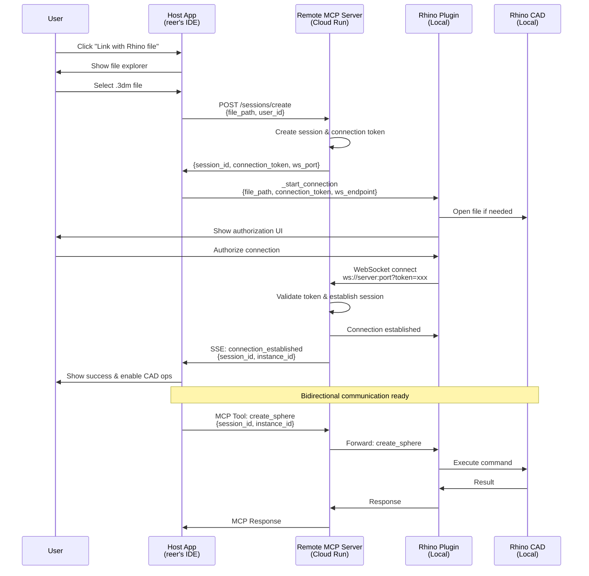

# Bidirectional Connection Implementation Plan

## Overview

This document outlines the implementation plan for the bidirectional connection system between the host application, remote MCP server, and local Rhino CAD instances.

## UX Flow Analysis

1. User starts host app (reer's IDE webapp)
2. User clicks "Link with Rhino file" 
3. Browser file explorer opens → user selects .3dm file
4. Host app backend connects to remote MCP server
5. Remote server creates a "connection session" and returns connection details
6. Host app attempts to open Rhino file (if not already open)
7. Host app calls Rhino plugin's _start_connection command with connection details
8. Rhino plugin shows authorization UI with connection details
9. User authorizes → plugin establishes bidirectional connection to remote server
10. Remote server validates connection and updates session state
11. Remote server notifies host app of successful connection
12. Host app shows success and enables CAD operations

### Flow diagram

## Implementation Phases

### Phase 1: Basic Connection Flow
1. Implement session creation endpoint
2. Create basic WebSocket server for Rhino connections
3. Implement Rhino plugin connection handler
4. Test basic connection establishment

### Phase 2: Message Routing
1. Implement message correlation system
2. Add CAD command routing
3. Handle connection errors and reconnection
4. Test bidirectional communication

### Phase 3: Enhanced Features
1. Add connection persistence
2. Implement multiple instance support
3. Add comprehensive error handling
4. Add monitoring and logging

## Security Considerations

1. **Token-based Authentication**: Each connection session uses a unique token
2. **Token Expiration**: Connection tokens expire after 10 minutes
3. **Origin Validation**: Validate that connections come from authorized sources
4. **Rate Limiting**: Prevent abuse of connection creation
5. **SSL/TLS**: Use secure connections in production

## Error Handling

1. **Connection Timeouts**: Handle cases where Rhino doesn't connect within timeout
2. **Network Failures**: Implement reconnection logic
3. **Invalid Tokens**: Proper error responses for authentication failures
4. **Resource Cleanup**: Clean up resources when connections fail

### Potential Issues

1. **File Open Timing**: If Rhino is not open, host app may attempt to open it before plugin is ready
2. **Authorization UI**: User may not see authorization UI if Rhino is already open
3. **Connection Stability**: WebSocket connection may drop if network conditions change
4. **Error Handling**: Proper error handling for connection failures
5. **Resource Cleanup**: Proper cleanup of resources when connections fail